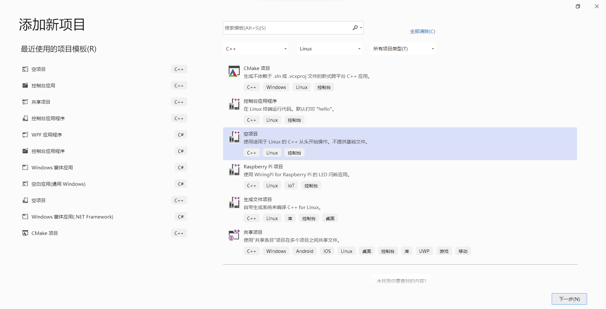

# 规范与提示

2021/8/28，贺兰山

##  一些补充

+ 以下针对C++，C不在考虑范围内（除非有强烈的理由开发C兼容的程序，否则尽量遵守）

+ C++上尽量使用nullptr关键词而不是NULL
+ 循环，判断语句即使只有一条，也用大括号括起来
+ 一定要加命名空间啊，各种算法都放在RoboTax命名空间下，并且可以在RoboTax命名空间下嵌套自己的子命名空间。一般来说应该不会有什么需要放在TinyROS命名空间下的。今天提交的代码因为没按规范使用命名空间，已经出现命名冲突了。
+ 关于驼峰命名，是指各单词之间连在一起，单词首字母大写。如果是大驼峰，则每个单词首字母都大写，小驼峰则第一个单词首字母小写，其余首字母大写。之前所述的类的字段名使用大驼峰，可以不针对私有字段，私有字段可根据实际情况决定怎么命名，例如私有指针以小写p开头，或者私有变量前面加下划线也是可以的。

---

2021/8/24，贺兰山

我们要开展综设C的各项工作了，此文件是关于此项目的一些规范，请大家务必遵守。另外也有一些提示。如有建议或者疑问请积极交流。

## 关于语言选择

+ 应张伟老师的主张，C/C++是王者，没啥好选的。
+ stm32上使用C（stm32沿用综设B的工作，基本上不会什么改动）
+ 树莓派上一律使用C++
+ PC上不使用图形界面的进程都尽量使用C++，例如图像处理、路径规划
+ 图形界面不限制，一些推荐：
  + 开发独立界面：C++&Qt、Java、C#（dotnet5.0框架WPF应用）
  + 开发网页：任意

## 关于开发工具

+ 统一使用Visual Studio来进行C++的开发，尽量用Visual Studio 2019
+ 图形界面如果使用C#，则也使用Visual Studio（微软亲儿子，没啥好选的），其他语言使用自己熟悉的工具就好

## 关于项目组织

+ 所有开发项目都位于Project目录下，该目录是一个Visual Studio目录的解决方案，里面有一个Project.sln文件，通过该文件可以打开Visual Studio解决方案
+ 如果要添加一个C++项目，应在Visual Studio解决方案资源管理器中，右键单击解决方案，选择添加->新建项目，然后即可向本解决方案中添加项目。通过此方法添加会成为project目录下的一个子目录，该目录下就是项目的各种资源，内部的组织形式不限，如果通过Visual Studio添加源文件的话默认就是直接放在目录下面的，但如果源文件较多，建议自己整理一下，分成不同的文件夹什么的。
+ 不要再新建Visual Studio的解决方案了
+ 其他项目在形式上与C++项目类似，一个项目作为一个目录，放在Project下，里面就是各种资源什么的了。虽然这些项目不会受到Visual Studio的管理，但在形式上保持一致。如果有少量的IDE配置文件，也可以直接放在Project下，但要注意避免冲突。

+ 除了各个项目会引用TinyROS以外，各个项目之间理论上是没有其他相互引用的。如果确实有需要被引用的项目，本解决方案里有一个共享项目，专门用来在项目之间共享内容，对应于Share目录。
  + 被引用方：在Share目录里新建一个子目录，一般来说与项目同名，然后将被引用的内容复制过去。
  + 引用方：在解决方案资源管理器的项目里右键单击引用->添加引用，然后添加该Share共享项目就好。
  + 注意：
    + 该规则主要适用于源文件，其他类型的引用，例如动态库，自行安排即可
    + 如果引用第三方库，也放在这里，例如Jsoncpp
    + 原则上不要引用其他位置的项目
    + 共享的内容要既要保证同步性，也要保证稳定性。既然是被其他项目引用的，那么要尽量稳定，不要出错；同时如果原先的项目有了推进，也要同步到共享项目里

## 关于项目管理

+ 项目的所有内容都通过Git管理，包括开发项目和其他内容例如文档等
+ 使用Git时注意所提交的内容，使用.gitignore文件忽略不必要的内容，例如Debug文件夹等
  + Project目录下已经有一个.gitignore文件了，该文件忽略了.vs，Debug，x64，bin，obj。如果有需要提交的以上文件夹名，自行手动提交
+ 积极进行进度同步，每次开发之前先pull，结束之后就push，不要纠结本次提交的工作量，不要老想着搞出一个大的进展之后才提交。
+ 提交的时候，提交的内容尽量写得清晰一点

## 关于C++代码风格

+ 使用C++ 11标准，更新的标准也可以，即使是C++ 20的预览特性，只要能编译过能运行就行

+ 有新标准的尽量用新标准，例如：
  + 使用using语句定义类型的别名而不是typedef
  + 使用static_cast，dynamic_cast，reinterpret_cast等运算符而不是旧的强制类型转换运算符
  + 能够用constexpr的地方尽量不要用宏定义
+ 我们开发的所有内容放在TinyROS命名空间或者RoboTax命名空间下，根据开发的内容选择具体是放在哪一个命名空间下
+ 自己开发的内容均使用驼峰命名，其中：
  + 类名（也包括结构体）、字段名（成员名）、方法名（函数名）使用大驼峰
  + 局部变量使用小驼峰
  + ps：文件名和文件夹名也尽量使用大驼峰
  + 标准库或者其他第三方库不是驼峰命名的就不要管了，我们自己用驼峰命名就好
  + Java的部分可以遵循Java自己的习惯（类名大驼峰，其他的小驼峰），其他语言也是
+ 类内部调用类的字段和方法时一律加上this->，不论是否需要

## 关于Visual Studio的一些提示

+ 开发window上的C++项目大家应该都比较熟悉了

+ 开发Linux上的C++项目，首先要为Visual Studio安装相关的模块（Linux C++开发，Linux工作负载等），可以在Visual Studio Installer里对Visual Studio进行修改
  + 然后，就可以向解决方案里添加Linux的C++项目了
  + 
  + 创建项目之后即可开发Linux的C++程序。接下来，需要连接到远程的Linux系统进行编译、调试和运行。可以是虚拟机或者WSL，也可以是一台真实的Linux电脑、例如树莓派。如果是虚拟机，入网方式需要选择为“桥接网卡”。该Linux系统上需要安装并启动ssh（自己找网上的教程），然后在Visual Studio上方的工具->选项->跨平台里输入IP地址（或者主机名）、用户名和密码连接该远程系统。随后即可在Visual Studio里进行生成和调试了。
  + Visual Studio本质上还是调用远程系统上的g++等工具进行编译的，各种选项，比如附加库目录、头文件路径或者命令行参数什么的都可以在项目的属性页里设置。Visual Studio会在远程计算机上生成一些文件，这些文件的路径也可以在属性页里设置。如果比较熟练的话也可以直接在Linux机器上编译和调试，不过项目本体还是要在Visual Studio上留一份。
  + Visual Studio在本地有一个Linux头文件的缓存，并不一定与实际的远程Linux环境相同，因此即使Visual Studio里提示打不开源文件、头文件什么的，依然可以尝试生成并运行，是有可能运行成功的。
  
+ 请大家一定注意自己所开发的项目将来要运行的平台，不要搞错平台了，一些地方难以移植导致最后运行不了。提示：树莓派是Linux系统，32位ARM架构。